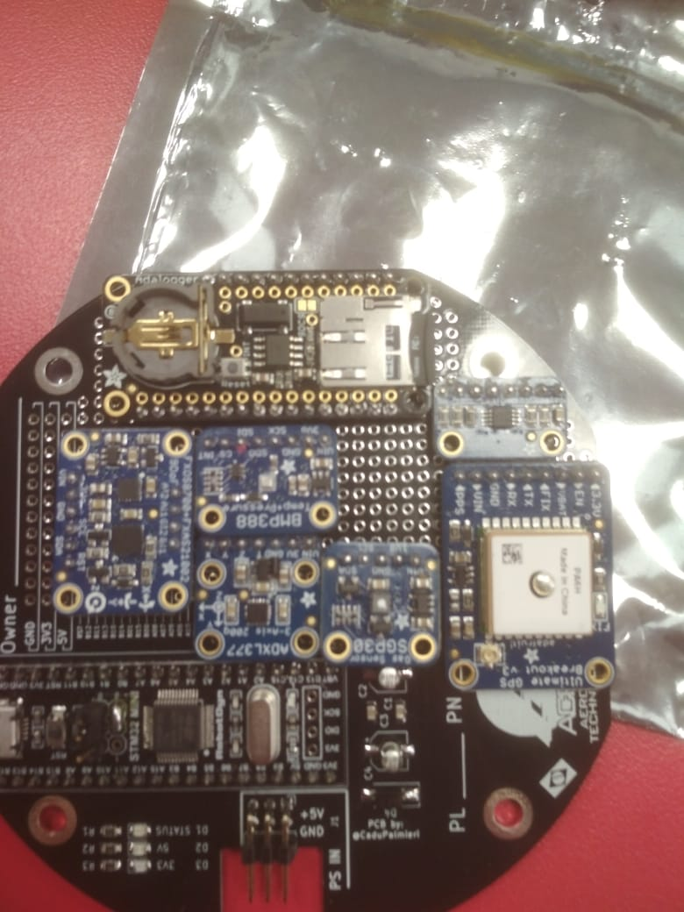

# Pruebas

Esta carpeta contiene todo lo que la persona que soldará la placa y realizará las pruebas de funcionamiento de esta y del codigo debe saber.

## Prueba Codigo

La prueba del codigo se puede hacer utilizando la placa de pruebas soldada por Gabriel. Como recomendación, no prueben el codigo completo, sino que es mejor probar parte por parte y modificarlas, para finalmente unir todo en el codigo final.

### Orden de prueba recomendado

- Tarjeta SD 
- Acelerometro
- Magnetometro
- Sensor de gases
- Sensor de Temperatura
- Sensor de presión

Los codigos para hacer las pruebas se encuentran enlazados a los sensores.

## Soldar placa

Orden de componentes para soldadura: 

