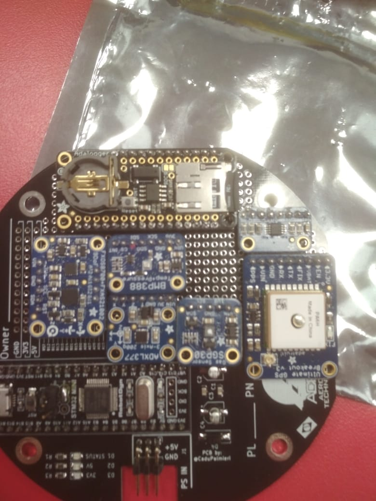

# CubeSat
USM Cubesat respositorio para Firmware

## Codigos
### Propuesta_V1

Autor: Nicolas Carrasco

#### Sensores 
- [Accelerometro](https://www.adafruit.com/product/1413)
- [Magnetometro](https://www.adafruit.com/product/3463)
- [Sensor de Temperatura](https://www.adafruit.com/product/1782)
- [Presión](https://www.adafruit.com/product/3966)
- [DataLogger](https://www.adafruit.com/product/2922)
- [Gases](https://www.adafruit.com/product/380)

#### Trabajos pendientes

Añadir [GPS](https://www.adafruit.com/product/746)

### Json

#### Formato

{"GPS":[Lat, Long, speed, angle, altitude, satelites], "Accelerometer": [x,y,z], "Magnetometer": [O1,O2,O3,O4,O5,O6,O7,O8,O9], "Temperatura":temp, "Presion": [presion hPa, SeaLeves, temp], "Gases": [VOC,co2,Eta,H2]}

Ejemplo:

{
"GPS":[
194509.000, 
71.1234, 
71.1234,
90.35,
2000.25,
5
],
"Accelerometer": [
3,
3,
3], 
"Magnetometer": [
200,
200,
200,
200,
200,
200,
200,
200,
200],
"Temperatura":
 30.5,
"Presion": [
1013.25 ,
1013.25,
20.1], 
"Gases": [
1000,
1000,
1000,
1000,
]
}

Peso del JSON medido a traves de [ArduinoJson Assistant](https://arduinojson.org/v6/assistant/) 

El cual tiene un peso de 553 bytes en el microcontrolador STM32. 

### Codigo Actual - Json V2
Autores: [Jose Tomas Dominguez](https://github.com/josetomas), Nicolas Carrasco

Union de Propuesta_V1, en lugar de dejar los datos en un buffer y subirlos a la SD, esta los almacena en un json y luego los sube a la SD. 

## Soldar Placa

Orden de componentes para soldadura: 

USM Cubesat respositorio para Firmware

